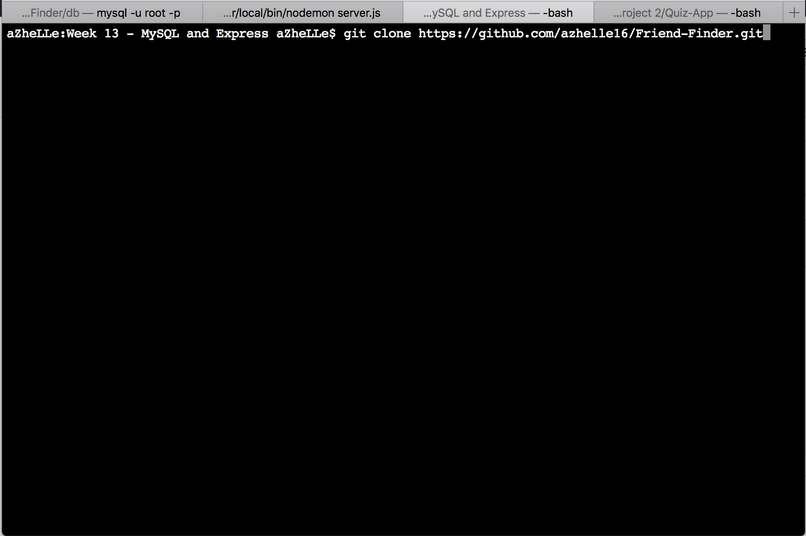
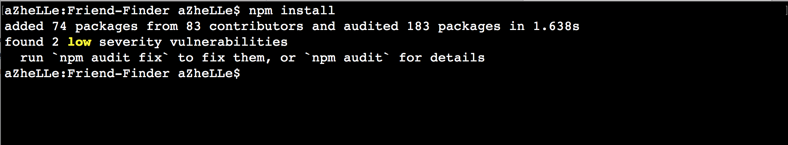
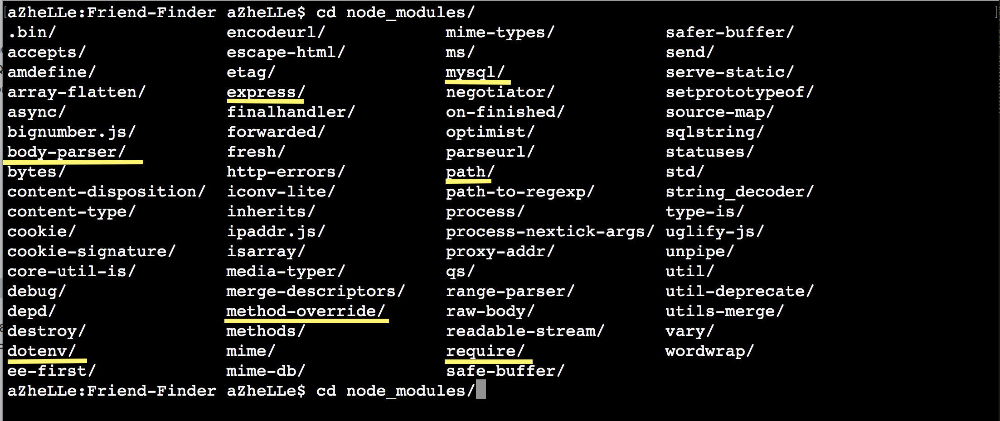
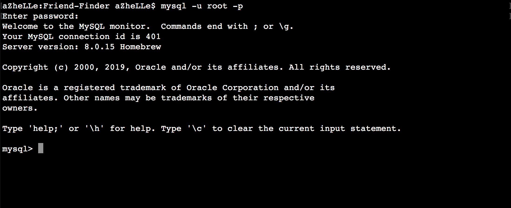
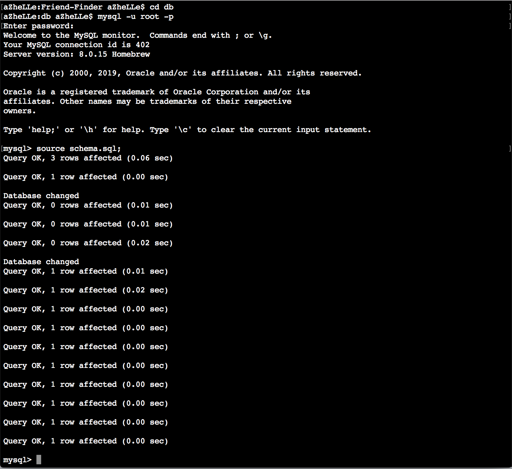
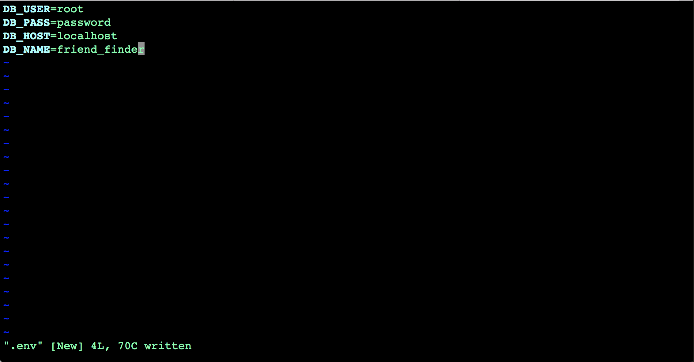
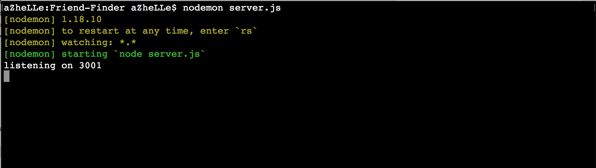
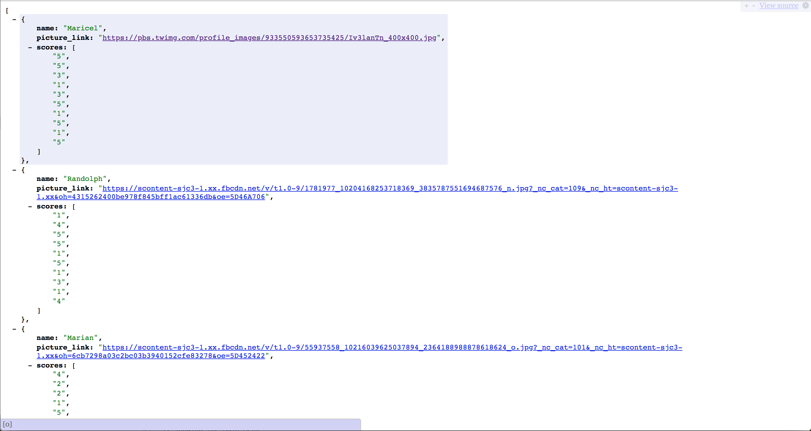
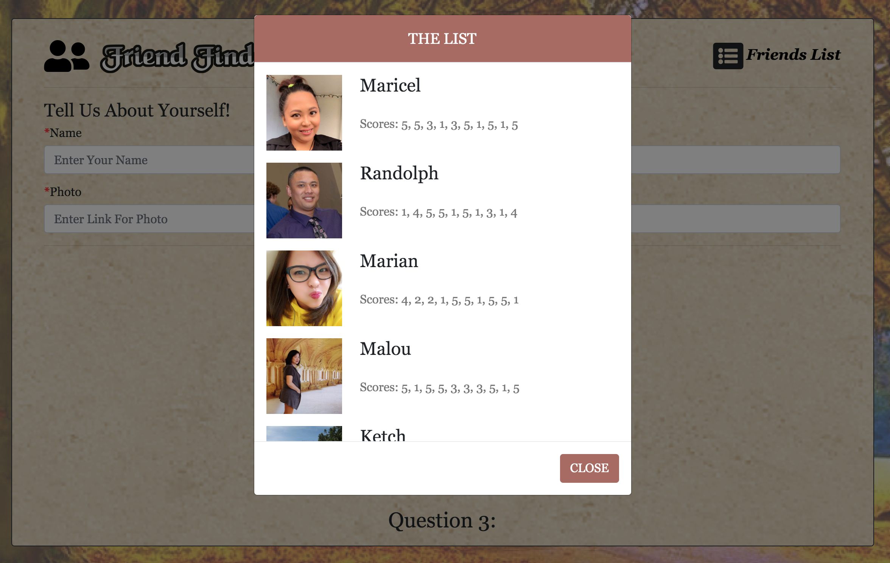

# Friend-Finder

## Description
The objective of this application is to find the best match for the user by answering 10 questions. The user's answers will be compared to the other friends' answers to find the best match. The application is coded using NodeJS, HTML5, CSS3 and JQuery.

## Packages

Require - _https://www.npmjs.com/package/require_

MySQL - _https://www.npmjs.com/package/mysql_

Express - _https://www.npmjs.com/package/express_

Body-Parser - _https://www.npmjs.com/package/body-parser_

Path - _https://www.npmjs.com/package/path_

Method-Override - _https://www.npmjs.com/package/method-override_

DotEnv - _https://www.npmjs.com/package/dotenv_

## System Requirements

1. NodeJS - version 10 and up

2. MySQL - version 8.0 

## Setting Up Your App

1. Download The Code 

2. Install The Packages Listed 

	- Using the _package.json_ file, run _"npm install"_ inside the Friend-Finder folder (see Figure 1)
		- if _"npm audit fix"_ shows up, just run the command after the installation 	
	- The packages listed above should be inside _"node\_modules"_ folder to make the app work. Otherwise, you have to manually download the package (Use the link to see instruction) (see Figure 2)

<i>Figure 1: Package Installation</i>

<i>Figure 2: Inside the node_modules folder. The yellow-lined modules are expected to be inside the folder for the app to work.</i>

3. Building Your Database

	- The download includes two SQL files which can be found inside the **_db_** folder. Go inside the **_db_** folder then login to your MySQL via Terminal using your username and password. (See Figure 3)
	- Once logged in, run **_schema.sql_**. (See Figures 4)

<i>Figure 3: Successful login inside the MySQL.</i>

<i>Figure 4: Running schema.sql.</i>

4. Create Your _.env_ File

	- Going back one directory up, create a file and save it as **_.env_**. Inside the file, provide your database credentials. (See Figure 5)

<i>Figure 5: Information inside the .env file.</i>

5. Running The App

	- You can also use _"node server.js"_ to run the application. Otherwise, install the _"nodemon"_ package (https://www.npmjs.com/package/nodemon)

**_Voila!_**/ You know have Friend Finder running in your browser :smile:

## Screenshots

1. Home Page

2. Survey Page

3. Friends List - JSON View

4. Friends List - HTML View

## Credits

Questions Used - _https://www.psychometricinstitute.com.au/Free-Personality-Test.asp_